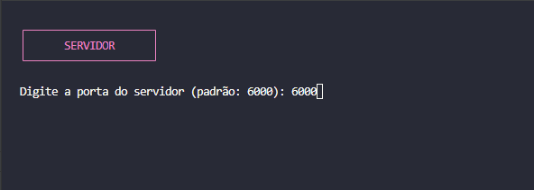
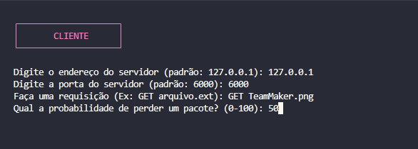
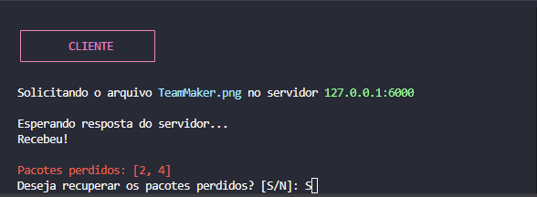
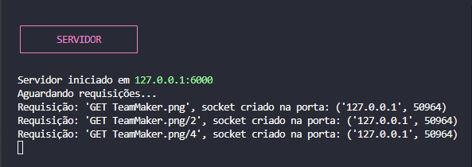

# Trabalho 1 #

Neste trabalho foi criado um programa capaz de enviar e receber sockets por meio de uma rede entre um cliente e um servidor.\
O trabalho foi criado com o intuito de entender, de forma prática, a lógica usada nas redes de aplicação UDP.

### Como o programa funciona
1. Primeiro, o servidor deve ser iniciado para começar a escutar conexões.
2. Em seguida, o cliente é iniciado e conecta-se ao servidor.
3. O cliente faz uma requisição ao servidor, enviando dados específicos.
4. O servidor processa a requisição e envia uma resposta de volta ao cliente.
5. O cliente recebe a resposta e o ciclo de comunicação pode continuar ou ser encerrado.

### Imagens do funcionamento

Abaixo estão imagens ilustrando cada etapa do funcionamento do programa:

1. **Iniciando o servidor:**
   
2. **Iniciando o cliente:**
   
3. **Cliente faz requisição:**
   
4. **Servidor responde:**
   
5. **Cliente recebe arquivo:**
   